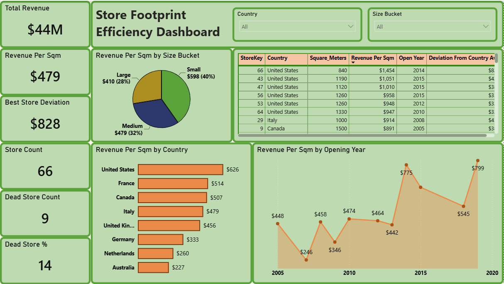

# Store Footprint Efficiency Dashboard

## Business Problem
A global electronics retailer operates 66 physical stores across 8 countries, each with different floor space. 
Revenue alone doesn't show whether that space is used well — a large store can underperform while a small one outshines it. 
Leadership needs to know which stores convert floor space into revenue efficiently, and which are wasting rent, staff, and inventory investment.

## Tools Used
SQL Server (data exploration) → Power BI + DAX (visualization)
 
## Dataset
Global Electronics Retailer (Maven Analytics) — Sales, Stores, Products tables
[Maven Analytics Data Playground](https://www.mavenanalytics.io/data-playground)
 
## Approach
1. SQL exploration in SQL Server Management Studio(7-part analysis: base check → revenue → productivity →
   country rollup → size segmentation → age check → outlier flagging)
2. Star schema model in Power BI (Direct Query mode, 3 lean views)
3. 6 KPIs + 4 interactive visuals + 2 slicers

## Key Insights
- 9 of 66 stores (14%) generate zero revenue — dead floor space across 5 countries, a
  company-wide issue, not one region's problem.
- Country-level averages are misleading — they hide problems in large markets (US has the most
  dead stores but looks healthiest on average) and exaggerate them in small ones (Netherlands,
  Australia).
- Small stores are more efficient per sqm ($575) than large stores ($410) — bigger footprint
  isn't translating to better returns.
- Store performance is tied to *when* it was opened — 2007 and 2009 were weak vintages, 2014
  and 2019 were strong — not a simple "older stores underperform" story.
- Strong performance is achievable at scale — the best-run store beats its own country average
  by over $800/sqm, proving the ceiling is high with the same footprint.

## Recommendations
- Audit and act on the 9 zero-revenue stores first — relocate, close, or investigate local
  causes (staffing, competition, location) before any further space investment.
- Freeze new large-format store openings until the size-vs-productivity gap is understood.
- Investigate the 2007/2009 store cohort specifically — a targeted, low-cost review of what
  went wrong in that expansion period.
- Study the best-performing store as a benchmark case and identify what can be replicated
  elsewhere.
- Rebalance floor space at large underperforming stores — consider downsizing rather than
  closing outright, to recover some of the wasted-space cost.

## Dashboard Preview

 
## SQL Highlights
 
Revenue per store, including stores with zero sales (LEFT JOIN preserves dead stores instead of
dropping them):
 
```sql
SELECT St.StoreKey, St.Country, St.Square_Meters,
    COALESCE(SUM(S.Quantity * P.Unit_Price_USD), 0) AS [Total Revenue]
FROM Stores St
LEFT JOIN Sales S ON St.StoreKey = S.StoreKey
LEFT JOIN Products P ON S.ProductKey = P.ProductKey
WHERE St.StoreKey <> 0
GROUP BY St.StoreKey, St.Country, St.Square_Meters;
```
 
Deviation from each store's own country average (catches outliers relative to local baseline,
not a flat global number):
 
```sql
SELECT StoreKey, Country, RevenuePerSqm,
    RevenuePerSqm - AVG(RevenuePerSqm) OVER (PARTITION BY Country) AS DeviationFromCountryAvg
FROM StoreRevenue;
```
 
Full script (all 7 sections) available in [`/sql/store_productivity_analysis.sql`](sql/SQL_Analysis.sql).
